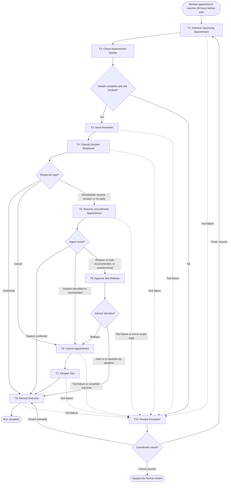

# Workflow of Tasks

## 1. Workflow Goal

This workflow supports the goal in our completed [team charter](https://github.com/Aidan-S-1/BUS4498_Team_Build/blob/main/README.md).

## 2. Workflow Trigger

One run starts when a booked Orfalea undergraduate advising appointment that falls inside the four-week registration window reaches 48 hours before its start time. An hourly scheduled scan of the scheduling system finds appointments that have crossed this point and starts one run per appointment.

## 3. Completion Condition at Runtime

A run ends successfully when the appointment has a final status in the scheduling system and a matching record exists in the SlotSaver outcome log. The final status is one of: confirmed by the student, held by advisor decision, or cancelled with the slot reopened for public booking. For cancelled appointments, the outcome record must show the cancellation time and the reopen time.

## 4. General Workflow

SlotSaver retrieves the appointment (T1) and checks that it is still booked and has the details needed to contact the student (T2). It sends the student a reminder with confirm, cancel, and reschedule options (T3). When the student replies, or when 24 hours pass with no reply, SlotSaver classifies the response (T4). A confirmation goes straight to Record Outcome (T8). A cancellation goes to Cancel Appointment (T6) and Reopen Slot (T7), which puts the slot back in the public booking queue and notifies waitlisted students, and then to T8. Reschedule requests, unclear replies, and no-reply cases go to the SlotSaver agent (T5). The agent gathers evidence such as duplicate bookings, waitlist demand, and the student's registration date, may send one follow-up, and may book a new slot only when the student explicitly picks it. If the student confirms, the run goes to T8. If the student cancels or reschedules, the original slot goes through T6 and T7.

The agent never releases a slot on its own. When it recommends releasing a no-reply booking, or when it cannot reach a supported result, the assigned advisor reviews its evidence summary (T9) and decides to release (T6, T7, T8) or hold (T8). If the advisor does not decide before the deadline, the booking is held. If required appointment details are missing, or a tool times out, fails, or exhausts its retries, the case goes to the advising office coordinator (T10) with the failure evidence. The coordinator either fixes the problem and resumes the run from T1 (every task checks current status first, so nothing is sent or cancelled twice), closes the case manually and records it through T8, or stops the run for further human review.

## 5. Workflow Diagram

